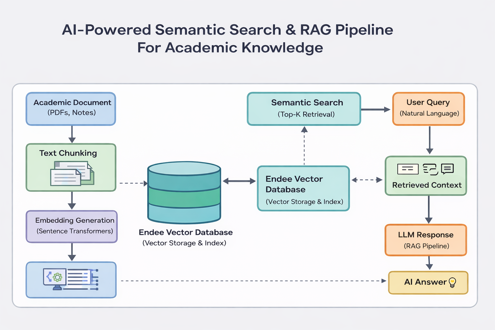

# AI-Powered Semantic Search & RAG Pipeline for Academic Knowledge using Endee Vector Database

## Overview
This project demonstrates an AI-powered semantic search system built using the Endee Vector Database. It implements a Retrieval-Augmented Generation (RAG) pipeline that allows users to query academic documents such as lecture notes, PDFs, and research papers using natural language.

Traditional keyword-based search often fails to retrieve meaningful context from large document collections. This system solves that problem by converting documents into vector embeddings and performing similarity search using the Endee vector database. The retrieved context is then passed to a language model to generate accurate and context-aware responses.

This project highlights the use of modern AI infrastructure including vector databases, semantic retrieval systems, and scalable AI search architectures.

---

## Problem Statement
Students and researchers often deal with large volumes of academic content including lecture notes, textbooks, and research papers. Finding specific information quickly using traditional keyword search can be difficult and inefficient.

There is a need for an intelligent search system that understands the meaning of queries instead of relying only on keyword matching.

---

## Solution
This project builds a semantic retrieval pipeline that combines:

- Transformer-based embeddings
- Vector similarity search
- Retrieval-Augmented Generation (RAG)
- Endee Vector Database for high-performance vector storage

The system converts academic documents into vector embeddings, stores them in the Endee vector database, and retrieves the most relevant content when a user asks a query.

The retrieved content is then used by an AI model to generate context-aware answers.

---

## System Architecture


Academic Documents (PDF / Notes)  
↓  
Text Chunking  
↓  
Embedding Generation (Sentence Transformers)  
↓  
Endee Vector Database (Vector Storage & Indexing)  
↓  
Semantic Search (Top-K Retrieval)  
↓  
Retrieved Context  
↓  
LLM Response (RAG Pipeline)

---

## Key Features

- Semantic search across academic documents
- Retrieval-Augmented Generation (RAG) pipeline
- High-speed similarity search using Endee Vector Database
- Natural language question answering
- Context-aware AI responses
- Scalable architecture for large document collections
- Vector embeddings powered by transformer models

---

## Technologies Used

- **Endee Vector Database** – High-performance vector storage and similarity search
- **Python** – Core backend implementation
- **Sentence Transformers** – Embedding generation
- **LangChain** – RAG pipeline orchestration
- **NumPy** – Vector similarity computation
- **Streamlit / Flask** – Simple user interface
- **GitHub** – Version control and project hosting

---

## How Endee is Used in this Project

Endee acts as the core infrastructure for semantic retrieval.

1. Academic documents are processed and split into smaller text chunks.
2. Each text chunk is converted into vector embeddings using a transformer model.
3. The embeddings are stored in the Endee vector database.
4. When a user submits a query, its embedding is generated.
5. Endee performs high-speed vector similarity search to retrieve the most relevant chunks.
6. The retrieved context is passed into a language model to generate the final answer.

This demonstrates how Endee can be used to build scalable AI-powered search systems.

---

## Setup Instructions

```bash
# 1 Clone the repository
git clone https://github.com/nishu-sharma-001/endee.git
cd endee

# 2 Install dependencies
pip install -r requirements.txt

# 3 Run document ingestion
python ingest.py

# 4 Start the application
python app.py
```
Future Improvements

Support for larger document collections

Multi-document reasoning

Real-time document updates

Integration with large-scale AI models

Web-based interactive UI

Conclusion

This project demonstrates how modern AI infrastructure such as vector databases and RAG pipelines can be used to build intelligent semantic search systems.

By leveraging the Endee Vector Database for fast vector similarity search, the system efficiently retrieves relevant information from academic content and generates meaningful answers using AI models.

The architecture can scale to support large document collections and can be extended for use cases such as research assistants, enterprise knowledge search, and AI-powered recommendation systems.

